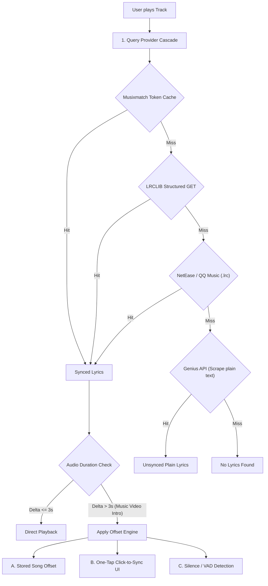

# NOIR — Lyrics Engine Enhancement & Synced Lyrics Roadmap
**Document Version:** 1.0.0  
**Target Reviewer:** AI Architect / Senior Full-Stack Engineer  
**Scope:** Architecture, Data Providers, Title Sanitization, Music Video Desync Solutions, and Multi-Provider Fallback.

---

## 0. Status & decisions (2026-10-01) — read this first

This plan was written by Gemini; what is actually decided and built differs from it in places.

**Built (phase 1 + part of 2):** title cleaning that keeps real parentheses, artist variants ("Kim Larsen & Kjukken" → "Kim Larsen"), widening lrclib search, retry on lrclib outages, strict sync tolerance (3 s) with an opt-in offset guess and nudge controls (Settings → Lyrics timing controls).

**Measured:** big English songs ≈ 100 % synced on lrclib. Newer Danish music (D1ma, Wicky, Gilli, Branco, Specktors, Rasmus Seebach…) mostly missing. NetEase barely helps for Danish, so it is not planned.

**Decisions:**
- NOIR is a hobby project; real users may never come. A release is a maybe, later.
- Several sources, each song uses whichever has it: **lrclib first, then others only if lrclib has no usable synced version.** Not all at once (cost, and it keeps load on unofficial sources low).
- **Musixmatch is an experiment, and it is uncertain.** It has the Danish coverage, but there is no free official synced-lyrics API: the only way is the unofficial token that Musixmatch's own desktop app uses, via a small proxy (browsers can't call it directly). That is against their terms, can stop working without warning, and funnelling every listener through one proxy IP is exactly what gets blocked. If it works, good; if it is blocked, lrclib still works as before and nothing is lost. If NOIR ever ships to many users, talk to Musixmatch about a real licence instead of relying on this.
- Spotify-side tools (e.g. Spicetify) reportedly use Musixmatch through Spotify's own token and agreement, which NOIR does not have, so that is not a precedent for us.
- Sources sit behind one adapter interface (`src/app/services/lyrics/`), so Musixmatch can be added or removed without touching the rest.

---

## 1. Executive Summary

NOIR currently retrieves lyrics exclusively via the public [LRCLIB](https://lrclib.net) API (`/api/search`) in [`src/app/hooks/useLyrics.ts`](file:///Users/applemacbook/AntiGravity%20Shit/Elva.nosync/Elva-redesign/src/app/hooks/useLyrics.ts). While LRCLIB provides open, rate-limit-free, and community-curated `.lrc` files, the application suffers from three key limitations:

1. **High Miss-Rate for Niche / Regional Tracks:** Many Danish, indie, and newly released songs are missing from LRCLIB.
2. **Brittle Search & Title Noise:** YouTube video stream titles often contain tags like `(Official Music Video)`, `[Lyrics]`, `feat. X`, or `prod. Y`. When passed verbatim or crudely stripped, search queries fail to match catalog metadata.
3. **Video Intro/Outro Desynchronization:** Audio streamed from YouTube music videos frequently includes narrative dialogue, silent pre-rolls, or credit sequences that shift the audio timeline by 5–30 seconds relative to the standard studio track. The current codebase enforces a strict 5-second duration tolerance (`SYNC_TOLERANCE_S = 5`), causing the engine to degrade to unsynced plain text rather than adapting.

This document outlines a production-ready, phased roadmap to achieve comprehensive synced lyrics coverage comparable to Spotify and Apple Music.

---

## 2. Current Architecture & Bottlenecks

### 2.1 File Map
- **[`src/app/hooks/useLyrics.ts`](file:///Users/applemacbook/AntiGravity%20Shit/Elva.nosync/Elva-redesign/src/app/hooks/useLyrics.ts):** Primary lyrics orchestration hook, candidate fetching, duration comparison, and active line tracking.
- **[`src/app/utils/stringUtils.ts`](file:///Users/applemacbook/AntiGravity%20Shit/Elva.nosync/Elva-redesign/src/app/utils/stringUtils.ts):** `cleanSongTitle()` and `getPrimaryArtist()` functions.
- **[`src/app/utils/lyricsUtils.ts`](file:///Users/applemacbook/AntiGravity%20Shit/Elva.nosync/Elva-redesign/src/app/utils/lyricsUtils.ts):** `.lrc` parser, custom lyrics persistence in `localStorage`, and timestamp interpolation.
- **[`src/app/components/shell/noir/NoirNowPlayingView.tsx`](file:///Users/applemacbook/AntiGravity%20Shit/Elva.nosync/Elva-redesign/src/app/components/shell/noir/NoirNowPlayingView.tsx):** UI rendering of synced and unsynced lyrics lines.
- **[`src/app/components/CustomLyricsModal.tsx`](file:///Users/applemacbook/AntiGravity%20Shit/Elva.nosync/Elva-redesign/src/app/components/CustomLyricsModal.tsx):** User-facing modal to edit, paste, or offset local `.lrc` lyrics.

### 2.2 Critical Vulnerabilities in Current Implementation

#### A. Single Free-Text Search Endpoint
Currently, `fetchCandidates` executes a single query:
```typescript
const query = encodeURIComponent(`${cleanSongTitle(title)} ${isLookupable(artist) ? artist : ''}`.trim());
const p = fetch(`https://lrclib.net/api/search?q=${query}`)
```
- LRCLIB provides a dedicated, structured endpoint: `/api/get?track_name=...&artist_name=...&album_name=...&duration=...`.
- The unstructured `/api/search?q=` endpoint frequently fails if the string contains minor spelling discrepancies, punctuation, or redundant featuring artists.

#### B. Naive Duration Tolerance Gate
```typescript
const SYNC_TOLERANCE_S = 5;
if (best.duration == null || Math.abs(best.duration - duration) <= SYNC_TOLERANCE_S) {
  return { lines: parseLrc(best.syncedLyrics!), synced: true };
}
return { lines: toPlainLines(best), synced: false };
```
- If a music video has an 8-second cinematic intro, `Math.abs(duration - videoDuration) > 5` evaluates to `true`.
- The hook drops synced playback entirely and downgrades to static text, discarding valid timestamp data that only needed an offset shift.

#### C. `cleanSongTitle` Destructive Regex
```typescript
export function cleanSongTitle(title: string): string {
  return title
    .replace(/\([^)]*\)/g, '')   // Strips genuine song titles like "(I Can't Get No) Satisfaction"
    .replace(/\[[^\]]*\]/g, '')
    .replace(/ft\..*$/gi, '')
    .replace(/feat\..*$/gi, '')
    .replace(/\|.*$/g, '')
    .replace(/"/g, '')
    .trim();
}
```
- Destroys parenthesized canonical titles.
- Fails to extract artist names prefixed into the title (e.g. `"Kendrick Lamar - Humble"` -> title remains `"Kendrick Lamar - Humble"` while artist is `"Kendrick Lamar"`, creating query `"Kendrick Lamar - Humble Kendrick Lamar"`).

---

## 3. Core Solutions & System Roadmap



---

### Phase 1: Robust Sanitization & Multi-Tier Search Fallbacks

#### 1.1 Multi-Tier Sanitizer (`sanitizeTitleVariants`)
Instead of a single destructive pass, create a prioritized variant generator:
1. **Tier 1 (Targeted Video Tags):** Remove only known video keywords: `(Official (Music )?Video)`, `[Official Audio]`, `[Lyric Video]`, `(Visualizer)`, `[HD]`, `[4K]`, `(Live at ...)` while preserving musical subtitles like `(Remix)`, `(Radio Edit)`.
2. **Tier 2 (Artist De-Duplication):** Detect `Artist - Title` patterns. If the artist is already in `artistName`, strip it from `title`.
3. **Tier 3 (Clean Canonical):** Strip all trailing parentheticals, `prod. by`, `feat.`, and delimiters.

#### 1.2 LRCLIB Dual-Stage Query Pipeline
1. **Stage 1 (Exact Match):** Call `/api/get` with structured parameters:
   ```typescript
   GET https://lrclib.net/api/get?track_name=${cleanTitle}&artist_name=${primaryArtist}&duration=${Math.round(duration)}
   ```
2. **Stage 2 (Fuzzy Search Fallback):** If `/api/get` returns 404, call `/api/search?q=${cleanTitle} ${primaryArtist}`.
3. **Stage 3 (Title-Only Search):** If still empty, search `/api/search?q=${cleanTitle}` and filter results client-side by fuzzy artist distance (Levenshtein / Dice coefficient).

---

### Phase 2: Solving Music Video Desync & Intros/Outros

#### 2.1 The Root Cause
- Studio album releases have standardized intro counts.
- Music videos on YouTube often insert 10–25 seconds of scene-setting, dialogue, or atmospheric sound effects.
- The lyrics timestamps are correct, but shifted by an absolute constant $t_{\text{offset}}$.

#### 2.2 Solution A: Stream Preference (Upstream Prevention)
Ensure the playback resolver ([`src/app/utils/chartPlaybackUtils.ts`](file:///Users/applemacbook/AntiGravity%20Shit/Elva.nosync/Elva-redesign/src/app/utils/chartPlaybackUtils.ts) / [`apiUtils.ts`](file:///Users/applemacbook/AntiGravity%20Shit/Elva.nosync/Elva-redesign/src/app/utils/apiUtils.ts)) prioritizes YouTube Music **Audio Tracks** (e.g. from YouTube Music "Topic" channels or official audio IDs) over narrative "Official Music Videos". Audio streams match Spotify durations within 1 second.

#### 2.3 Solution B: Dynamic Timestamp Offset Engine
Introduce an adjustable `offset` parameter into `useLyrics`:
$$\text{effectiveLyricTime} = \text{lyricLine.time} + \text{songOffset}$$

#### 2.4 Solution C: "One-Tap Click-to-Sync" (User-Centric UX)
When a song is flagged with a duration mismatch ($\Delta t > 5\text{s}$), maintain synced mode but show a discreet timing indicator:
- **Interaction:** The user listens to the song. As soon as the first lyric is uttered, the user clicks the corresponding line in the UI.
- **Formula:**
  $$\text{Offset} = \text{audio.currentTime} - \text{clickedLine.rawTimestamp}$$
- **Persistence:** Save `lyrics_offset_${songKey}` to `localStorage` or IndexedDB. Once set, the song is permanently synced for that user.

#### 2.5 Solution D: Heuristic Audio Intro Detection (Silence / VAD)
Using the Web Audio API (`AudioContext` + `AnalyserNode`):
- Analyze the first 30 seconds of audio.
- Detect the transition from low-energy/speech spectrum to high-energy rhythmic percussion/bass (beat drop).
- If energy onset occurs at $+14.2\text{s}$ while the first lyric timestamp is at $+2.0\text{s}$, automatically seed initial offset as $+12.2\text{s}$.

---

### Phase 3: Provider Hierarchy (Musixmatch, NetEase & Genius)

To transition from 60% coverage to 95%+ coverage:

| Provider | Sync Capability | Catalog Strengths | Authentication / Access Requirements |
| :--- | :--- | :--- | :--- |
| **Musixmatch** | Line-by-line & Word-by-word | Global mainstream, Nordic/Danish, Spotify parity | User-token derived from official desktop/web client; needs proxy or Electron main process to bypass CORS/Cloudflare |
| **LRCLIB** | Line-by-line | English, Open-source community | Free, public, no token required, CORS-enabled |
| **NetEase Cloud** | Line-by-line | Massive archive of `.lrc` files | Unofficial public API (`/api/song/lyric?id=...`), open access |
| **Genius** | Unsynced Plain Text | Largest global lyrics repository, fastest new release updates | Genius Client Access Token, HTML scraping for full text body |

#### 3.1 Abstract Provider Interface
```typescript
export interface LyricsCandidate {
  provider: 'musixmatch' | 'lrclib' | 'netease' | 'genius' | 'custom';
  isSynced: boolean;
  lines: LyricLine[];
  duration?: number;
  offset?: number;
}

export interface LyricsProvider {
  name: string;
  fetchLyrics(title: string, artist: string, duration?: number): Promise<LyricsCandidate | null>;
}
```

#### 3.2 Provider Cascade Waterfall
```typescript
async function resolveLyrics(title: string, artist: string, duration: number): Promise<LyricsCandidate | null> {
  // 1. Check user local custom override
  const custom = loadCustomLyrics(undefined, title, artist);
  if (custom) return { provider: 'custom', isSynced: custom.isSynced, lines: custom.lyrics };

  // 2. Try primary synced providers concurrently or in waterfall
  const lrclibPromise = fetchLrclib(title, artist, duration);
  const musixmatchPromise = fetchMusixmatch(title, artist, duration).catch(() => null);

  const syncedResult = await Promise.any([musixmatchPromise, lrclibPromise].map(p => p.then(r => {
    if (r && r.isSynced && r.lines.length > 0) return r;
    throw new Error('No synced lyrics');
  }))).catch(() => null);

  if (syncedResult) return syncedResult;

  // 3. Fallback to NetEase .lrc
  const neteaseResult = await fetchNetEase(title, artist).catch(() => null);
  if (neteaseResult?.isSynced) return neteaseResult;

  // 4. Final fallback: Genius plain text
  const geniusResult = await fetchGenius(title, artist).catch(() => null);
  if (geniusResult) return geniusResult;

  return null;
}
```

---

### Phase 4: Community Contribution (Closing the Loop)

LRCLIB exposes an open contribution API:
- `POST https://lrclib.net/api/publish`
- When a user uses the existing [`CustomLyricsModal.tsx`](file:///Users/applemacbook/AntiGravity%20Shit/Elva.nosync/Elva-redesign/src/app/components/CustomLyricsModal.tsx) to align or enter lyrics, offer an optional checkbox:  
  *“Share synced lyrics with community (LRCLIB)”*.
- This crowdsources coverage directly from user fixes.

---

## 4. Risks & Review Considerations for Peer AI

1. **CORS & Rate Limiting:**
   - Calling Musixmatch directly from a browser web client will fail due to CORS and Cloudflare bot protection.  
   - *Recommendation:* If running in Electron (`electron/main.cjs`), route requests through Node `net`/`fetch` where CORS does not apply. If running in pure Web/Vite mode, deploy a lightweight Cloudflare Worker or Edge Function proxy.
2. **Performance / Network Overhead:**
   - Firing 3+ external API requests on every song change could add latency and trigger rate-limits.
   - *Mitigation:* Cache results in IndexedDB (`lyrics_cache`) with a 7-day TTL. Warm cache via prefetch during track queueing.
3. **Over-Sanitization False Positives:**
   - Stripping parentheticals must be carefully tested against song titles that naturally include parentheses (e.g. `(Don't Fear) The Reaper`, `(Sittin' On) The Dock of the Bay`).

---

## 5. Recommended Implementation Steps

- [ ] **Step 1:** Refactor `cleanSongTitle` in `src/app/utils/stringUtils.ts` to output clean primary title, subtitle, and artist tokens without destroying canonical parentheticals.
- [ ] **Step 2:** Upgrade `useLyrics.ts` to query LRCLIB `/api/get` first, falling back to `/api/search`.
- [ ] **Step 3:** Implement the Dynamic Timing Offset Engine in `useLyrics.ts` and add the one-tap "Click-to-Sync" affordance in `NoirNowPlayingView.tsx`.
- [ ] **Step 4:** Integrate persistent song-level offset cache in `localStorage`.
- [ ] **Step 5:** Add Musixmatch / NetEase secondary provider adapters behind an Electron / proxy interface.
- [ ] **Step 6:** Add Genius plain-text fallback adapter to guarantee lyrics availability when syncing is unavailable.
